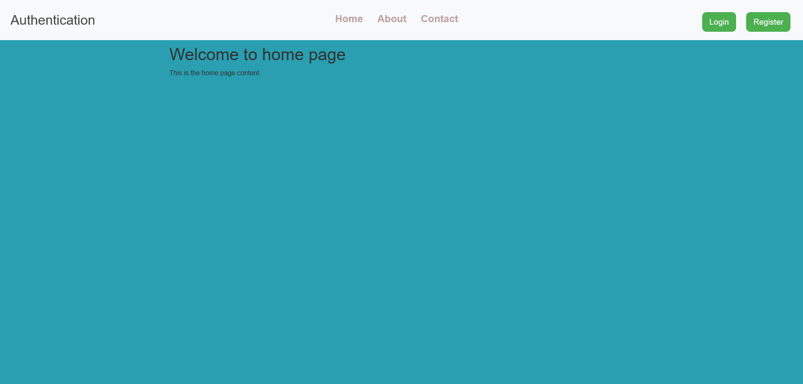
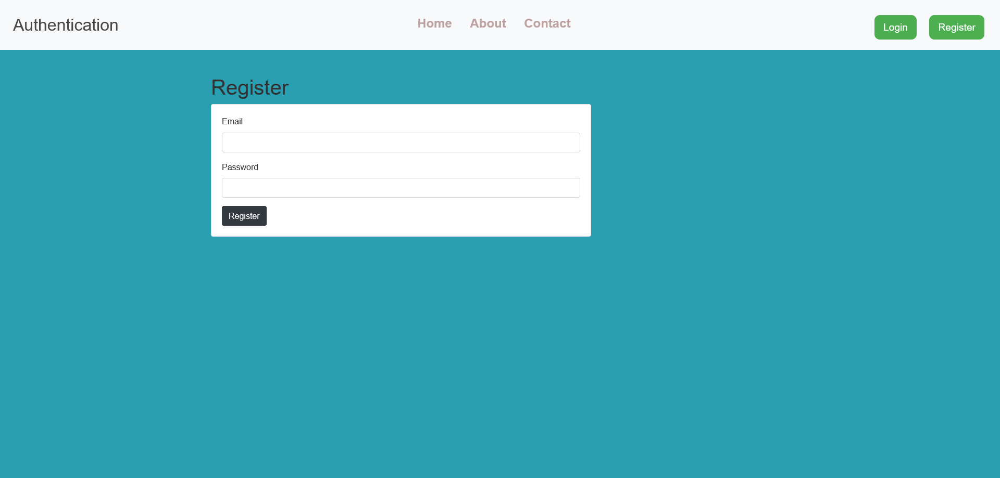

# Node+Express+Authen+Ejs+Postgres

Application d'authentification simple avec Node.js, Express, EJS et PostgreSQL.

## Description

Ce dépôt contient une application d'authentification qui utilise :
- Express pour le serveur HTTP
- EJS pour le rendu des vues (`views/`)
- bcrypt pour le hachage des mots de passe
- PostgreSQL (module `pg`) pour stocker les utilisateurs

Les routes principales présentes dans `index.js` : `/`, `/login`, `/register` et une page protégée `/secret`.

## Prérequis

- Node.js (recommandé : 18+)
- npm
- PostgreSQL (version récente)

## Installation

Cloner le dépôt :

```bash
git clone https://github.com/<votre-utilisateur>/<nom-du-repo>.git
cd <nom-du-repo>
```

Installer les dépendances :

```bash
npm install
ou
npm i
```

### Configuration de la base de données

- Créez la base de données (exemple) :

```sql
CREATE DATABASE "Auth";

\c "Auth";

CREATE TABLE users (
  id SERIAL PRIMARY KEY,
  email VARCHAR(255) UNIQUE NOT NULL,
  password VARCHAR(255) NOT NULL,
);
```
creer le fichier `.env` dans votre projet racine :

```
DB_USER=postgres
DB_HOST=localhost
DB_NAME=Auth
DB_PASSWORD=votre_password
DB_PORT=5432
PORT= 8000
```


## Scripts utiles

Ajoutez ces scripts dans `package.json` pour faciliter le développement :

```json
"scripts": {
  "start": "node index.js",
  "dev": "nodemon index.js",
  "test": "npm test"
}
```

## Exécution

Démarrer le serveur :

```bash
npm run start
# ou
nodemon index.js
```

Par défaut l'application écoute sur le port `8000` (cf. `index.js`).

---

## Maquettes / Screenshots

Voici quelques captures d'écran / maquettes du projet. Remplace ces fichiers par tes propres images si tu veux.

### Aperçu — Écran d'accueil



### Connexion


### Inscription




